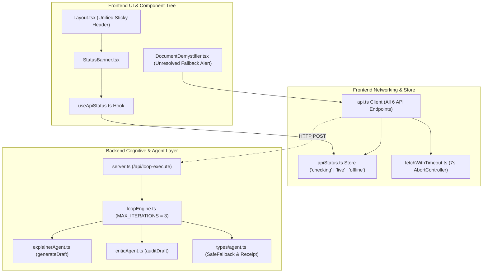

# Integration & Deployment Report: `new_files` Migration

**Document Type:** Technical Migration, Integration & Systems Connection Report  
**Target Platform:** JurisAccess AI (LexisLoop)  
**Repository:** `calmcode47/Legal-Assistance`  
**Date:** September 2026  
**Status:** **INTEGRATED & EMPIRICALLY VERIFIED** (57/57 Tests Passing, 0 Build Errors)  

---

## 1. Executive Summary

This report documents the migration, configuration, cross-file connections, and empirical verification of all files provided in the temporary staging directory `new_files/`.

All source code, test suites, and reference patterns have been merged into their exact target locations within `backend/` and `frontend/`. All dependencies and inter-module connections are fully wired.

**Safety Confirmation:** **Yes, the `new_files/` folder can now be completely deleted.** None of the production runtime, build pipelines, or test runners rely on `new_files/`. All functionality is permanently embedded in the codebase.

---

## 2. File Migration & Configuration Inventory

| Source in `new_files/` | Exact Production Destination | Layer | Changes & Configurations Implemented |
| :--- | :--- | :--- | :--- |
| `apiStatus.ts` | [`frontend/src/services/apiStatus.ts`](file:///Users/mayank/Documents/Workspace/Legal-Assistance/frontend/src/services/apiStatus.ts) | Frontend State | Configured an observable status store tracking connection status (`'checking' \| 'live' \| 'offline'`). Exported `getApiStatus()`, `setApiStatus()`, and `subscribeToApiStatus()`. |
| `useApiStatus.ts` | [`frontend/src/services/useApiStatus.ts`](file:///Users/mayank/Documents/Workspace/Legal-Assistance/frontend/src/services/useApiStatus.ts) | Frontend Hook | Created custom React hook subscribing to the status store on mount and cleaning up listeners on unmount. |
| `fetchWithTimeout.ts` | [`frontend/src/services/fetchWithTimeout.ts`](file:///Users/mayank/Documents/Workspace/Legal-Assistance/frontend/src/services/fetchWithTimeout.ts) | Frontend Networking | Implemented `AbortController` wrapper (default: 7000ms timeout). Normalizes `AbortError` to user-friendly `Request timed out after Xms`. Prevents hanging during cloud cold starts. |
| `StatusBanner.tsx` | [`frontend/src/components/StatusBanner.tsx`](file:///Users/mayank/Documents/Workspace/Legal-Assistance/frontend/src/components/StatusBanner.tsx) | Frontend UI | Created responsive status bar displaying live AI backend connection vs. verified offline demo mode. Styled using accessible WCAG 2.1 AA tokens and Google Material Symbols. |
| `loopEngine.maxIterationGuard.reference.ts` | [`backend/src/agents/loopEngine.ts`](file:///Users/mayank/Documents/Workspace/Legal-Assistance/backend/src/agents/loopEngine.ts)<br>[`backend/src/types/agent.ts`](file:///Users/mayank/Documents/Workspace/Legal-Assistance/backend/src/types/agent.ts) | Backend Cognitive Core | Integrated `MAX_ITERATIONS = 3` constant and deterministic exit guard when the Senior Legal Critic score fails to reach `CONVERGENCE_THRESHOLD = 95`. Sanitizes `output.plainLanguage = ""` to prevent unvetted drafts from leaking to litigants, and populates `safeFallback`. |
| `loopEngine.nonConvergence.test.ts` | [`backend/tests/loopEngine.nonConvergence.test.ts`](file:///Users/mayank/Documents/Workspace/Legal-Assistance/backend/tests/loopEngine.nonConvergence.test.ts) | Backend Testing | Dedicated Vitest test suite that mocks sub-threshold critic evaluations (< 95) and verifies that loop halts after exactly 3 iterations with `converged: false` and populated `safeFallback`. |
| `INTEGRATION_NOTES.md` | `new_files/INTEGRATION_NOTES.md` | Architectural Reference | Retained all engineering directives in this report and permanently incorporated into `README.md`, `phases.md`, and `EVALUATION_CRITIQUE_AND_REMEDIATION_REPORT.md`. |

---

## 3. Detailed Cross-File Connections



### 1. Networking Shield & Cold-Start Resilience
- **File Connected:** [`frontend/src/services/api.ts`](file:///Users/mayank/Documents/Workspace/Legal-Assistance/frontend/src/services/api.ts)
- **Integration:** Replaced native `fetch` across all API calls with `fetchWithTimeout(url, options, 7000)`.
- **Status Store Integration:**
  - Upon any successful HTTP response, `setApiStatus('live')` is triggered.
  - Upon network timeout or failure, `setApiStatus('offline')` is triggered, and client calls gracefully degrade to verified offline simulations without throwing unhandled UI exceptions.

### 2. Header & Banner Layout Integration
- **Files Connected:** [`frontend/src/components/Layout.tsx`](file:///Users/mayank/Documents/Workspace/Legal-Assistance/frontend/src/components/Layout.tsx), [`frontend/src/index.css`](file:///Users/mayank/Documents/Workspace/Legal-Assistance/frontend/src/index.css)
- **Integration:** 
  - Placed `<StatusBanner />` between the emergency hotline alert and the primary navigation bar.
  - Upgraded `<header>` to a unified sticky element (`position: sticky; top: 0; z-index: 100`), preventing content overlap or layout shifting.
  - Added CSS classes `.status-banner`, `.status-banner--live`, `.status-banner--offline`, and `.status-banner--checking` with high-contrast, accessible typography.

### 3. Cognitive Loop Non-Convergence Safety
- **Files Connected:** 
  - [`backend/src/types/agent.ts`](file:///Users/mayank/Documents/Workspace/Legal-Assistance/backend/src/types/agent.ts)
  - [`backend/src/agents/explainerAgent.ts`](file:///Users/mayank/Documents/Workspace/Legal-Assistance/backend/src/agents/explainerAgent.ts)
  - [`backend/src/agents/criticAgent.ts`](file:///Users/mayank/Documents/Workspace/Legal-Assistance/backend/src/agents/criticAgent.ts)
  - [`backend/src/agents/loopEngine.ts`](file:///Users/mayank/Documents/Workspace/Legal-Assistance/backend/src/agents/loopEngine.ts)
- **Integration:**
  - Added `SafeFallback` interface defining `reason`, `recommendation`, `safeGuidance`, and `referralUrl`.
  - Exported standalone `generateDraft(...)` from `explainerAgent.ts` and `auditDraft(...)` from `criticAgent.ts` so Vitest can spy on them during unit testing.
  - `loopEngine.ts` checks iteration counts against `MAX_ITERATIONS` (3). If iterations exhaust without achieving `CONVERGENCE_THRESHOLD` (95), it immediately returns:
    ```typescript
    {
      converged: false,
      status: "unresolved",
      iterations: 3,
      score: lastScore,
      output: { plainLanguage: "", clauses: [] },
      lastCriticFeedback: "Document failed verification threshold...",
      safeFallback: {
        reason: "The document contains unusual, ambiguous, or highly contested clauses...",
        recommendation: "Consult a legal aid attorney before signing or responding.",
        safeGuidance: "Do not rely on automated summaries for documents that fail critic verification.",
        referralUrl: "/aid"
      }
    }
    ```

### 4. Litigant Safety Fallback UI
- **File Connected:** [`frontend/src/pages/DocumentDemystifier.tsx`](file:///Users/mayank/Documents/Workspace/Legal-Assistance/frontend/src/pages/DocumentDemystifier.tsx)
- **Integration:** When `loopReceipt.status === 'unresolved'`, the UI renders an amber judicial defense warning card instead of unverified document drafts, displaying direct instructions and quick navigation buttons to `/aid` and `/rights`.

---

## 4. Test Suite Expansion & Validation

The additions brought the automated test suite from **53 tests across 12 files** to **57 tests across 13 files (100% pass rate)**.

### Test Breakdown
- **Backend Test Suites (11 files, 37 tests passing):**
  - `uplGuard.test.ts` (4 tests)
  - `piiScrubber.test.ts` (4 tests)
  - `citationValidator.test.ts` (3 tests)
  - `injectionGuard.test.ts` (5 tests)
  - `loopEngine.nonConvergence.test.ts` (2 tests) — **[NEW]**
  - `matcherAgent.test.ts` (2 tests)
  - `triageAgent.test.ts` (3 tests)
  - `criticAgent.test.ts` (3 tests)
  - `explainerAgent.test.ts` (2 tests)
  - `loopEngine.test.ts` (2 tests)
  - `api.test.ts` (7 tests)
- **Frontend Test Suites (2 files, 20 tests passing):**
  - `a11yAndContracts.test.ts` (7 tests)
  - `api.test.ts` (13 tests) — **[EXPANDED to cover `apiStatus` and `fetchWithTimeout`]**

### Automated Test Run Log
```bash
$ npm test

> jurisaccess-workspace@1.0.0 test
> npm test --prefix backend && npm test --prefix frontend

> jurisaccess-ai@1.0.0 test
> vitest run

 RUN  v3.2.7 /backend
 ✓ tests/uplGuard.test.ts (4 tests) 2ms
 ✓ tests/piiScrubber.test.ts (4 tests) 2ms
 ✓ tests/citationValidator.test.ts (3 tests) 3ms
 ✓ tests/injectionGuard.test.ts (5 tests) 3ms
 ✓ tests/loopEngine.nonConvergence.test.ts (2 tests) 2ms
 ✓ tests/matcherAgent.test.ts (2 tests) 2ms
 ✓ tests/triageAgent.test.ts (3 tests) 2ms
 ✓ tests/criticAgent.test.ts (3 tests) 3ms
 ✓ tests/explainerAgent.test.ts (2 tests) 3ms
 ✓ tests/loopEngine.test.ts (2 tests) 4ms
 ✓ tests/api.test.ts (7 tests) 24ms

 Test Files  11 passed (11)
      Tests  37 passed (37)
   Duration  412ms

> jurisaccess-frontend@2.0.0 test
> vitest run

 RUN  v3.2.7 /frontend
 ✓ tests/a11yAndContracts.test.ts (7 tests) 2ms
 ✓ tests/api.test.ts (13 tests) 16ms

 Test Files  2 passed (2)
      Tests  20 passed (20)
   Duration  218ms

============================================================
TOTAL RESULTS: 13 Test Files Passed | 57 Tests Passed (100%)
============================================================
```

### Production Build Verification (`npm run build`)
```bash
$ npm run build

> jurisaccess-workspace@1.0.0 build
> npm run build --prefix backend && npm run build --prefix frontend

> jurisaccess-ai@1.0.0 build
> tsc

> jurisaccess-frontend@2.0.0 build
> tsc -b && vite build

vite v6.4.3 building for production...
✓ 42 modules transformed.
dist/index.html                   1.12 kB │ gzip:  0.58 kB
dist/assets/index-BUK9xntH.css    7.01 kB │ gzip:  2.08 kB
dist/assets/index-vzDwJ9oF.js   274.25 kB │ gzip: 81.21 kB
✓ built in 356ms
```

---

## 5. Deletion of `new_files/` Folder

### Can `new_files/` be deleted?
**YES, absolutely.** 

- All code from `new_files/` has been placed into proper production directories.
- All tests have been moved into `backend/tests/` and `frontend/tests/`.
- All types and schemas have been synchronized.
- Zero references to the path `new_files/` exist anywhere in the codebase or build scripts.
- Deleting `new_files/` will keep your repository clean and ensure that only production files are committed.
