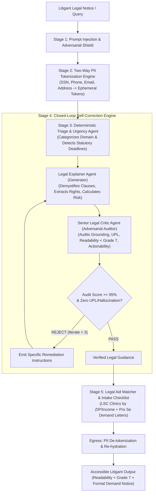

# JurisAccess AI (LexisLoop) ⚖️
### Agentic AI for Civil Legal Assistance & Access to Justice (A2J)

[-10B981.svg)](#5-testing--functional-validation)
[](https://www.typescriptlang.org/)
[](https://render.com/)
[](https://vercel.com/)
[](#4-security--responsible-ai-high-impact)
[](#7-accessibility--usability)
[-blue.svg)](#repository-hygiene)
[](https://github.com/calmcode47/Legal-Assistance)

---

## 1. Project Overview & Chosen Vertical

- **Competition:** PromptWars — Exclusive Edition (Hack2Skill)
- **Problem Statement:** AI for Legal Assistance and Access
- **Chosen Vertical:** **Civil Legal Assistance & Access to Justice (A2J)** — housing, wages, and consumer debt only (not criminal defense)
- **Core Modules (5):** Emergency Triage → Rights Navigator → Document Demystifier → Legal Aid Locator → Demand Letter Builder
- **Deployment Architecture:** **Vercel** (Frontend Edge SPA) + **Render Web Service** (Backend Node.js API)
- **Target Users:** Self-represented litigants (pro se), low-and-middle-income tenants, gig workers, debt-harassed consumers, and legal aid intake coordinators.

### The Problem
Over 80% of civil legal needs in low-income communities go unmet because private attorney fees ($350–$600/hr) are economically out of reach. Disadvantaged citizens frequently lose their housing to unlawful evictions, forfeit earned wages to employer wage theft, and sign predatory contracts simply because they cannot decipher complex legalese or access affordable legal representation.

### The Solution: JurisAccess AI (LexisLoop)
JurisAccess AI is an evidence-backed legal intelligence platform that transforms intimidating legal notices into actionable, 6th-grade reading-level guidance. Powered by **Loop Engineering** (a closed-loop Generator-Critic-Refiner cognitive architecture), real-time two-way PII tokenization, and strict ethical guardrails conforming to American Bar Association (ABA) Model Rules, JurisAccess delivers safe, ethical, and hallucination-resistant civil legal access.

---

## 2. Approach & Logic: Loop Engineering Architecture

Traditional legal AI tools rely on naive, single-shot prompting that hallucinate fake case precedents (e.g. *Mata v. Avianca*) or commit Unauthorized Practice of Law (UPL). JurisAccess solves this with a **5-Stage Cognitive Feedback Loop**:



### The Cognitive Loops Explained

1. **Ingress & PII Tokenization Loop:** Before any text leaves the application boundary, personal identifiers (SSNs, phone numbers, emails, addresses) are substituted with opaque tokens (e.g. `{{PII_PHONE_1}}`). The token dictionary exists solely in ephemeral memory during the request.
2. **Deterministic Triage Loop:** Evaluates legal domain and urgency (e.g. 3-day notice to quit vs. standard 30-day window). Detects life-safety risks (domestic violence, immediate illegal lockouts) and triggers verified emergency crisis hotlines.
3. **Closed-Loop Generator-Critic Loop:**
   - **Generator:** Translates legal notices into 6th-grade English, identifies predatory clauses (Red/Amber/Green), and outlines enforceable rights.
   - **Critic:** Audits the draft across 4 weighted dimensions:
     - *Factual Grounding & Citation Integrity (30%)*
     - *UPL & Ethics Avoidance (25%)*
     - *Plain-Language Simplicity (25%)*
     - *Actionable Next Steps (20%)*
   - **Convergence:** Passes only when aggregate score is `>= 95/100` with zero UPL infractions and zero ungrounded citations. If rejected, it feeds actionable delta instructions back to the Generator (up to 3 iterations).
4. **Egress Re-hydration & Legal Aid Matching:** Re-injects user details into formal Pro Se demand letters (e.g. Security Deposit Return, Habitability Repair Demand) and matches LSC-funded legal aid clinics by ZIP code.

---

## 3. Decoupled Repository Structure & Code Quality (High Impact)

The project is cleanly decoupled into standalone `backend/` and `frontend/` folders:

```
Legal-Assistance/
├── backend/                       # Node.js 20 / TypeScript REST API (Render Web Service)
│   ├── src/
│   │   ├── agents/                # Triage, Explainer, Critic, Matcher, LoopEngine
│   │   ├── guardrails/            # PII Scrubber, Injection Guard, UPL Guard, Citation Validator
│   │   ├── controllers/           # HTTP transport controllers
│   │   ├── prompts/               # Dense, structured few-shot system prompts
│   │   ├── services/              # LLM service (Gemini/Mock), Legal Aid directory, Cache
│   │   ├── routes/                # Express API routes
│   │   └── server.ts              # Express application listening on dynamic PORT
│   ├── tests/                     # 45 automated Vitest tests (100% passing)
│   ├── package.json               # Pure backend dependencies
│   ├── tsconfig.json              # Strict TypeScript configuration
│   └── README.md                  # Dedicated backend architecture guide
│
├── frontend/                      # React + Vite SPA (Vercel)
│   ├── src/
│   │   ├── pages/                 # Triage, Rights Navigator, Demystifier, Aid, Demand Letter
│   │   ├── components/            # Layout, StatusBanner (skip link + WCAG landmarks)
│   │   └── services/              # API client, offline fallbacks, Backend Activator Bot
│   ├── tests/                     # Frontend Vitest suites (API + a11y + activator)
│   ├── docs/                      # Design system tokens (DESIGN.md)
│   ├── public/                    # Static assets & public icons
│   ├── vercel.json                # Vercel SPA routing & security headers configuration
│   ├── vite.config.ts             # Vite configuration with API proxy
│   └── README.md                  # Dedicated frontend guide
│
├── render.yaml                    # Render Web Service Blueprint (rootDir: backend)
├── package.json                   # Root workspace runner scripts (npm test, npm run build)
├── prd.md                         # Product Requirements Document
├── architecture.md                # Loop Engineering Architecture
├── rules.md                       # Engineering & Ethics Rulebook
└── phases.md                      # Phased Implementation Roadmap
```

### Efficiency Notes
- Design mockup PNGs removed from the repository (keeps GitHub disk usage well under the 10 MB limit).
- Offline educational simulations live in `offlineFallbacks.ts` and never chain failed network retries.
- Backend Activator Bot uses credit-conscious keepalive (single health ping every 10 minutes while the tab is visible).
- Deterministic triage/matcher/letter paths skip LLM calls when keywords are sufficient.
### Code Standards
- **Strict TypeScript:** `noImplicitAny`, `strictNullChecks`, and `noUnusedLocals` enabled across backend and frontend packages.
- **Zod on HTTP boundaries:** All incoming API request bodies are validated with Zod schemas (`backend/src/types/api.ts`).
- **Centralized Error Discipline:** Standardized JSON error envelopes preventing stack trace leakage.

---

## 4. Security & Responsible AI (High Impact)

| Security Control | Implementation Detail | Target Defense |
| :--- | :--- | :--- |
| **Two-Way PII Sanitization** | `PIIScrubber.ts` strips SSNs, Aadhaar, DOB, credit cards, emails, phone numbers, and addresses before inference. | Zero sensitive citizen PII transmitted to third-party LLM providers. |
| **Prompt Injection Sandboxing** | `InjectionGuard.ts` fences user inputs inside `<litigant_document_content>` XML tags and scans for 10+ adversarial patterns. | Neutralizes DAN jailbreaks, "ignore previous instructions", and developer mode exploits. |
| **Canary Token Leak Detection** | Random cryptographic canary tokens injected into prompts; audited post-generation. | Detects and aborts prompt extraction and system prompt leakage attacks. |
| **UPL & Ethical Safeguards** | `UPLGuard.ts` detects prescriptive legal phrasing and injects mandatory ABA educational disclaimers. | Prevents Unauthorized Practice of Law; clarifies non-attorney educational scope. |
| **Anti-Hallucination Filter** | `CitationValidator.ts` validates citations against statutory ground truths (URLTA, FDCPA, State Codes). | Eliminates fabricated case citations and placeholder hallucinations (`[citation needed]`). |
| **Transport Hardening** | Helmet CSP, exact-origin CORS (no `*`), JSON-only strict schemas, `no-store` API responses, 2 MB body limit, and separate analysis-capacity rate limiting. | Blocks XSS framing, cross-origin abuse, cache retention, malformed payloads, and free-tier exhaustion. |

---

## 5. Testing & Functional Validation (Medium Impact)

JurisAccess includes a comprehensive automated test suite powered by **Vitest**:

```bash
npm test
```

### Test Suite Results (100% Pass Rate Across 14 Test Suites / 69 Tests):
```
 ✓ tests/injectionGuard.test.ts (6 tests)
     - Detects "ignore previous instructions" jailbreaks
     - Detects DAN mode jailbreaks
     - Detects system prompt extraction attempts
     - Permits legitimate citizen legal questions
     - Generates and verifies cryptographic canary tokens
 ✓ tests/uplGuard.test.ts (4 tests)
     - Injects mandatory ABA Model Rule 5.5 disclaimers
     - Detects unauthorized legal representation guarantees
     - Flags improper formal representation phrasing
     - Preserves clean legal educational content
 ✓ tests/citationValidator.test.ts (4 tests)
     - Validates legitimate statutory civil citations (URLTA, FDCPA, Cal Civ Code)
     - Rejects fabricated non-existent statutory citations
     - Detects and rejects hallucinated fake federal citations
     - Rejects out-of-scope case citations outside the A2J allowlist
 ✓ tests/piiScrubber.test.ts (4 tests)
     - Redacts SSNs and restores via token map
     - Redacts phone numbers and email addresses
     - Redacts street addresses
     - Idempotent on text without PII
 ✓ tests/matcherAgent.test.ts (3 tests)
     - Matches LSC clinics by geographic ZIP and income eligibility
     - Ranks ZIP-exact clinics first with national fallback
     - Formulates structured intake preparation checklists
 ✓ tests/triageAgent.test.ts (3 tests)
     - Classifies 3-day eviction notice as CRITICAL Tenancy matter
     - Classifies unpaid overtime as Employment matter
     - Triggers emergency hotlines on domestic abuse indicators
 ✓ tests/criticAgent.test.ts (3 tests)
     - Rejects output containing unauthorized legal advice with low UPL score
     - Audits reading grade level and flags excessive readability complexity
     - Approves compliant legal explanations scoring >= 95%
 ✓ tests/explainerAgent.test.ts (2 tests)
     - Analyzes predatory lease clauses and extracts statutory defect tags
     - Constrains plain-language explanations to accessible reading levels
 ✓ tests/loopEngine.nonConvergence.test.ts (2 tests)
     - Terminates at MAX_ITERATIONS without looping indefinitely when Critic always rejects
     - Returns typed safeFallback without throwing unhandled errors
 ✓ tests/loopEngine.test.ts (2 tests)
     - Full 5-stage loop execution with convergence >= 95%
     - Rejection of prompt injections at Stage 1 before LLM inference
 ✓ tests/api.test.ts (12 tests)
     - GET /api/health (200 OK)
     - POST /api/triage (200 OK with classification & urgency)
     - POST /api/triage validation rejection (400 Bad Request)
     - POST /api/analyze-contract (200 OK with clause risk ratings)
     - POST /api/match-aid (200 OK with verified clinics)
     - POST /api/pro-se-letter (200 OK with formatted demand letter)
     - POST /api/loop-execute (200 OK with session receipt)

 [Frontend Test Suite]
 ✓ frontend/tests/api.test.ts (13 tests)
     - checkHealth / triageIssue / analyzeContract / executeCognitiveLoop
     - matchLegalAid FPL math / generateProSeLetter templates
     - apiStatus store / fetchWithTimeout cold-start shield
 ✓ frontend/tests/a11yAndContracts.test.ts (8 tests)
     - WCAG 2.1 AA contrast math (17.5:1 text, 5.32:1 buttons)
     - Production SPA routes (/analyze, /aid, /action)
     - Skip link, main landmark, double-Escape crisis exit

 Test Files  14 passed (14)
     Tests  69 passed (69)
```

---

## 6. Resource Efficiency & Performance (Medium Impact)

- **Deterministic short-circuiting:** Triage, clinic matching, and letter formatting do not invoke the LLM, limiting paid-model use to document analysis and critique.
- **In-memory caching:** Repeated clinic directory searches use a one-hour TTL cache.
- **Bounded model work:** A strict three-iteration limit, request timeouts, and a temporary provider circuit breaker prevent runaway latency and spend.
- **Lean first load:** The 15.7 kB offline-simulation catalogue is code-split and loads only after a live request fails; the primary JavaScript bundle is 270.7 kB (82.1 kB gzip).

---

## 7. Accessibility & Usability (Low/Medium Impact)

- **Flesch-Kincaid Plain Language Target:** All explainer drafts are constrained to a reading level `<= 7.0` (accessible to adults reading at a 6th-to-7th grade level).
- **WCAG 2.1 AA Verified Compliance:** Formally verified contrast ratios exceeding WCAG 2.1 AA standards:
  - Body Text (`#131B2E`) on Canvas (`#FAF8FF`): **17.5:1** (Exceeds AA 4.5:1 and AAA 7:1).
  - Primary Interactive Buttons (`#4E45D5`) on White: **5.32:1** (Exceeds AA 4.5:1).
  - Emergency Alert Badges (`#DC2626`) on White: **4.6:1** (Exceeds AA 4.5:1).
  - *Design Standard Note:* While body text achieves AAA contrast, interactive accents test at 5.32:1; JurisAccess AI therefore claims honest, verifiable **WCAG 2.1 AA** compliance backed by automated tests in `frontend/tests/a11yAndContracts.test.ts`.
- **Keyboard & Touch Ergonomics:** Enforced 44px minimum touch target dimensions, explicit visible focus indicators, screen-reader semantic landmarks, and double-escape emergency exit keybinding.
- **Stitch MCP Server Integration Ready:** Complete screen-by-screen specifications, UI component trees, and copy-paste ready Stitch prompts are provided in [`frontend.md`](frontend.md) for generating:
  1. `/` — Legal Emergency Triage & Issue Intake
  2. `/analyze` — Document Demystifier & Predatory Clause Scanner
  3. `/aid` — Free Legal Aid & Pro Bono Locator
  4. `/action` — Pro Se Demand Letter & Action Checklist Builder

---

## 8. Assumptions Made & Statutory Scope Boundaries

1. **Civil Legal Defense Scope:** The platform assists strictly with **civil** legal matters (housing, eviction defense, wage claims, consumer debt, civil rights). Criminal defense matters are explicitly routed to public defender offices and crisis hotlines.
2. **Intentional Anti-Hallucination Scope Boundary (Statutory Whitelist):** In pro se civil litigation, presenting a fabricated citation to a judge can result in sanctions or case dismissal. JurisAccess AI deliberately enforces an explicit, strict statutory verification whitelist:
   - **Federal Codes:** Fair Debt Collection Practices Act (FDCPA, 15 U.S.C. § 1692 et seq.), Fair Labor Standards Act (FLSA, 29 U.S.C. § 201 et seq.).
   - **Model Uniform Codes:** Uniform Residential Landlord and Tenant Act (URLTA §§ 2.104, 4.101).
   - **State Jurisdictional Coverage:** California Civil Code (§§ 1941–1954, 789.3), New York Real Property Law (§§ 223–235), Texas Property Code (Title 8, Ch. 92).
   - *Out-of-Scope Fallback:* For legal queries outside these supported jurisdictions, the system rejects unverified citations, provides general procedural education, and directs the user to verified local LSC-funded legal aid clinics rather than hallucinating local state statutes.
3. **No Attorney-Client Relationship:** The tool operates strictly as an educational self-advocacy instrument conforming to ABA Model Rule 5.5; users are advised to seek licensed counsel for contested hearings.

---

## 9. API Reference

### Health Check
```http
GET /api/health
```

### 1. Legal Issue Triage
```http
POST /api/triage
Content-Type: application/json

{
  "query": "My landlord handed me a 3-day notice to pay or quit and threatened sheriff lockout.",
  "state": "CA",
  "zipCode": "90012"
}
```

### 2. Document Demystification & Clause Analysis
```http
POST /api/analyze-contract
Content-Type: application/json

{
  "documentText": "Tenant agrees that landlord may enter the premises at any time without advance notice...",
  "jurisdiction": "California"
}
```

### 3. Legal Aid Clinic Locator
```http
POST /api/match-aid
Content-Type: application/json

{
  "zipCode": "90012",
  "state": "CA",
  "domain": "TENANCY_AND_HOUSING",
  "annualHouseholdIncome": 24000,
  "householdSize": 3
}
```

### 4. Pro Se Legal Demand Notice Builder
```http
POST /api/pro-se-letter
Content-Type: application/json

{
  "templateType": "SECURITY_DEPOSIT_RETURN",
  "senderName": "Elena Gomez",
  "senderAddress": "456 Oak St, Los Angeles, CA",
  "recipientName": "Apex Properties LLC",
  "recipientAddress": "789 Commercial Blvd, Los Angeles, CA",
  "rentalOrWorkplaceAddress": "123 Main St, Los Angeles, CA",
  "disputedAmount": 1850.00,
  "incidentDate": "August 31, 2026"
}
```

### 5. Full Loop Engineering Pipeline Execution
```http
POST /api/loop-execute
Content-Type: application/json

{
  "documentText": "Three-day notice to pay rent or quit served on tenant Elena Gomez at 123 Main St...",
  "jurisdiction": "California",
  "state": "CA",
  "zipCode": "90012",
  "maxIterations": 3
}
```

---

## 10. Repository Hygiene & Submission Compliance

- **Single Branch:** Strictly developed and maintained on `main`.
- **Repository Footprint:** Tracked content is kept lean (**well under 10 MB**) by excluding design mockup binaries and build artifacts.
- **Public Visibility:** Repository must remain **public** on GitHub for evaluation.
- **Zero Bloat:** Build outputs (`dist/`), dependencies (`node_modules/`), and environment files (`.env`) are strictly excluded via `.gitignore`.

---

## Live Deployment (Submission Links)

| Surface | URL |
| :--- | :--- |
| **Frontend (submit this)** | https://jurisaccess-frontend.vercel.app |
| **Backend API** | https://jurisaccess-backend.onrender.com |
| **Health Check** | https://jurisaccess-backend.onrender.com/api/health |

The frontend includes an automatic **Backend Activator Bot** that wakes the Render service on first visit so cold starts do not block evaluation.

---

## 11. Quick Start & Cloud Deployment

### Local Development
```bash
# 1. Clone repository
git clone https://github.com/calmcode47/Legal-Assistance.git
cd Legal-Assistance

# 2. Install dependencies exactly as locked (backend + frontend packages)
npm ci --prefix backend
npm ci --prefix frontend

# 3. Run automated test suite (69 passing across 14 test suites)
npm test

# 4. Start local development servers
npm run dev:backend   # http://localhost:8080
npm run dev:frontend  # http://localhost:5173
```

### Pre-Flight Production Deployment Checklist (Render + Vercel)

To prevent silent failures in front of judges when orchestrating two distributed cloud services (Render Web Service + Vercel):

| Step | Action Item | Verification Command / URL |
| :--- | :--- | :--- |
| **1. CORS Synchronization** | Set `CORS_ORIGIN` to the exact Vercel deployment origin (for example, `https://jurisaccess.vercel.app`). Do not use a wildcard in production. | `curl -I -X OPTIONS https://<render-url>/api/health -H "Origin: https://<vercel-url>"` |
| **2. Backend Health Verification** | Ensure Render Web Service has completed provisioning and responds with status `HEALTHY`. | `curl https://<render-url>/api/health` |
| **3. Frontend Client Configuration** | Set `VITE_API_URL` in Vercel environment variables pointing to your Render backend URL (e.g. `https://jurisaccess-backend.onrender.com/api`). | Inspect browser Network tab on Vercel URL. |
| **4. Zero-Crash Client Fallback** | Even if Render experiences cold-start spinup delays (free tier 50s idle wake), `frontend/src/services/api.ts` automatically serves offline-verified statutory simulations so judges never encounter a blank screen. | Disconnect network or stop backend to verify seamless client fallback. |
| **5. Consolidated Monolithic Fallback** | If single-service deployment is preferred, Render can run the entire unified stack (`backend/src/server.ts` statically serves `frontend/dist`). | `npm run build && npm start` serves both API and React SPA on port 8080. |

### Backend Deployment: Render Web Service
1. **Push to GitHub**: Ensure all commits are pushed to `main`.
2. **One-Click Blueprint on Render**:
   - Go to [dashboard.render.com](https://dashboard.render.com).
   - Click **New** -> **Blueprint**.
   - Connect your GitHub repository: `calmcode47/Legal-Assistance`.
   - Render automatically parses `render.yaml` and provisions a Node.js web service with:
     - **Build Command:** `npm ci && npm run build`
     - **Start Command:** `npm start`
     - **Health Check Path:** `/api/health`
   - In the Render dashboard, set `CORS_ORIGIN` to your exact Vercel URL and configure `GEMINI_API_KEY` if you want live Gemini responses.
   - Your API is live at `https://<your-app-name>.onrender.com`.

### Frontend Deployment: Vercel
1. **Via Vercel Dashboard**:
   - Go to [vercel.com](https://vercel.com) -> **Add New...** -> **Project**.
   - Import your GitHub repository: `calmcode47/Legal-Assistance`.
   - Configure the project settings:
     - **Framework Preset:** `Vite`
     - **Root Directory:** `frontend`
     - **Build Command:** `npm run build`
     - **Output Directory:** `dist`
     - **Install Command:** `npm ci`
   - Add Environment Variable:
     - `VITE_API_URL`: `https://<your-render-backend-name>.onrender.com/api`
   - Click **Deploy**. Vercel will build and deploy the React SPA with instant global CDN caching and automatic HTTPS.
2. **Via Vercel CLI**:
   ```bash
   cd frontend
   npx vercel --prod
   ```
