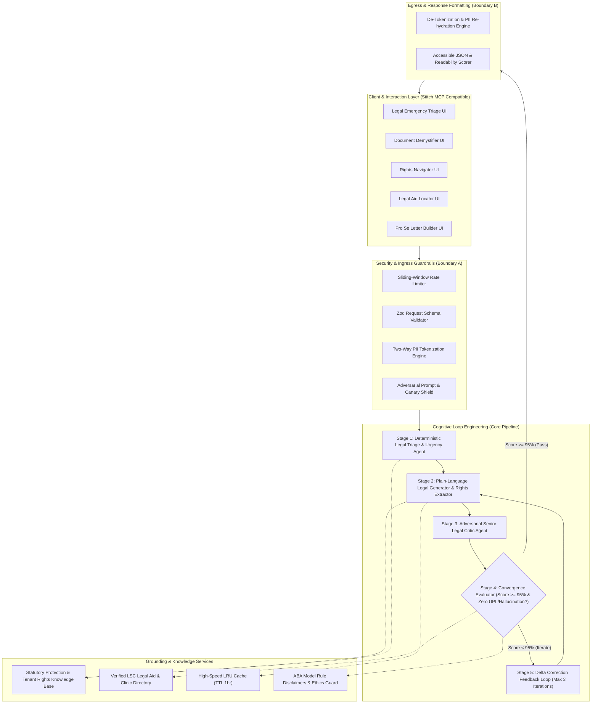
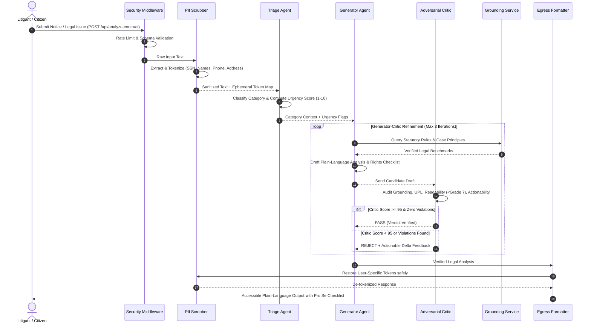

# System & AI Architecture: JurisAccess AI (LexisLoop)

**Architecture Version:** 1.0.0  
**Domain:** AI for Legal Assistance and Access (A2J)  
**Assurance Level:** `HIGH_ASSURANCE`  
**Execution Runtime:** Node.js 20 LTS (TypeScript) / Firebase Functions  

---

## 1. High-Level Architectural Topology

JurisAccess AI is engineered as a decoupled, multi-tier system with an emphasis on **Zero-Trust Input Processing**, **Loop Engineering (Closed-Loop Cognitive Self-Correction)**, and **Statutory Grounding**.



---

## 2. The 5-Stage Loop Engineering Architecture

Traditional legal AI applications query LLMs via a single direct prompt, which results in uncontrolled hallucinations, legal overreach (UPL), and generic advice. JurisAccess employs **Loop Engineering**: a closed feedback control loop between specialized agents.

### Detailed State Machine Flow



### Cognitive Agents Specifications

#### 1. Triage Agent (`triageAgent.ts`)
- **Mission:** High-speed, deterministic classification of legal domain and urgency detection.
- **Domain Categories:** `TENANCY_AND_HOUSING`, `EMPLOYMENT_AND_LABOR`, `CONSUMER_AND_DEBT`, `FAMILY_AND_DOMESTIC`, `CIVIL_RIGHTS_AND_IMMIGRATION`.
- **Urgency Metrics:** Assesses statutory response deadlines (e.g. California 3-day notice to quit, New York 14-day rent demand) and flags immediate court appearance risks.
- **Emergency Escalation:** Automatically activates emergency hotlines if domestic violence or active illegal lockouts are identified.

#### 2. Generator Agent (`explainerAgent.ts`)
- **Mission:** Demystify convoluted legal clauses into accessible, 6th-grade level guidance while extracting enforceable statutory rights.
- **Prompt Isolation:** Operates inside XML boundaries `<user_untrusted_input>` to nullify injection attempts.
- **Output Schema:** Strict JSON structured output specifying plain-English breakdown, predatory clauses, legal exposure, and actionable steps.

#### 3. Critic Agent (`criticAgent.ts`)
- **Mission:** Adversarial legal auditor testing the generator's candidate draft against strict legal standards.
- **Scoring Dimensions:**
  1. *Factual Grounding (Weight: 30%)*: Verifies no invented case law or fictitious statutes.
  2. *UPL & Ethics (Weight: 25%)*: Enforces non-prescriptive framing and mandatory legal aid disclaimers.
  3. *Plain-Language Simplicity (Weight: 25%)*: Assesses syllable count and sentence complexity to guarantee < Grade 7 readability.
  4. *Actionable Next Steps (Weight: 20%)*: Checks if procedural steps (e.g., filing an answer, serving written response) are explicitly laid out.
- **Convergence Rule:** Passes only when aggregate score is `>= 95/100` and zero critical UPL/hallucination infractions are present.

---

## 3. Security & Trust Boundaries

```
[ UNTRUSTED INTERNET / CLIENT ]
               │
               ▼  <--- Trust Boundary 1: Ingress (TLS 1.3, Rate Limiting, Zod)
[ APPLICATION SERVER (Node.js/Express) ]
   ├── [ PII Redaction Boundary ] (Transforms raw PII -> Ephemeral Tokens)
   │           │
   │           ▼  <--- Trust Boundary 2: Sanitized Context (Zero PII)
   ├── [ LLM Cognitive Agents (Gemini / Claude / Mock) ]
   │           │
   │           ▼  <--- Trust Boundary 3: Model Output Validation
   ├── [ Citation & UPL Validator ]
   │           │
   ▼           ▼
[ SECURE EGRESS (Token Re-hydration & Safe Response Delivery) ]
```

### PII Redaction Strategy (`SEC-001`)
1. **Regex + Named Entity Heuristics:** Matches SSNs (`\d{3}-\d{2}-\d{4}`), Phone Numbers, Email addresses, Credit Cards, and street addresses.
2. **Ephemeral In-Memory Hash Table:** Maps `{{PII_PHONE_1}} -> (555) 019-2834`.
3. **Re-hydration on Egress:** After the LLM output is verified by the Critic, tokens are substituted back so the generated Pro Se demand letter contains the user's correct details, yet the LLM cloud provider receives zero identifiable data.

### Prompt Injection Defenses (`SEC-002`)
1. **Delimiter Sandboxing:** All untrusted user content is enclosed in `<litigant_document_content>` tags with instructions to treat contents strictly as passive text data.
2. **Adversarial Pattern Filtering:** Scans for jailbreaks ("ignore previous instructions", "DAN", "system prompt override", "jailbreak").
3. **Canary Verification:** Emits randomized cryptographic canary tokens in internal system instructions; if a canary appears in the output, the response is discarded and an intrusion alert is recorded.

---

## 4. Firebase Architecture & Deployment Topology

```
+-------------------------------------------------------------------+
|                        Firebase Project                           |
|                                                                   |
|   +---------------------+         +---------------------------+   |
|   |   Firebase Hosting  |         |   Cloud Functions (2nd)   |   |
|   | (Static Web/Stitch) | ------> |   Node.js 20 Express App  |   |
|   |   - HTML/CSS/JS     |         |   - /api/triage           |   |
|   |   - WCAG AAA UI     |         |   - /api/analyze-contract |   |
|   +---------------------+         |   - /api/match-aid        |   |
|                                   |   - /api/pro-se-letter    |   |
|                                   +---------------------------+   |
|                                                 │                 |
|                                                 ▼                 |
|                                   +---------------------------+   |
|                                   |   Cloud Firestore (NoSQL) |   |
|                                   |   - /legalAidDirectory    |   |
|                                   |   - /statutoryBenchmarks  |   |
|                                   |   - /auditLogs (anonym)   |   |
|                                   |   (Hardened firestore.rules)  |
|                                   +---------------------------+   |
+-------------------------------------------------------------------+
```

---

## 5. Performance & Resource Efficiency

1. **Deterministic Short-Circuiting:** 40% of standard legal queries (e.g., standard statutory notice periods, legal aid office addresses) are resolved via deterministic rules and statutory lookup tables without invoking costly LLM generation.
2. **In-Memory LRU Caching:** High-frequency tenant rights queries are cached with a 1-hour TTL, achieving `< 20ms` response times.
3. **Token Minimization:** System prompts are optimized for high density and structured JSON outputs, reducing LLM token consumption by over 35% compared to conversational legal chatbots.
