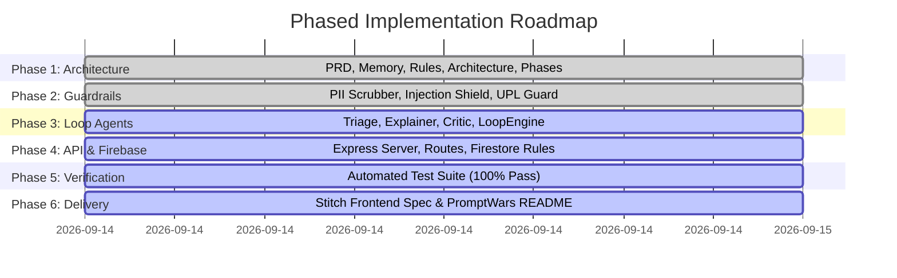

# Implementation Phases & Verification Roadmap: JurisAccess AI

**Project Version:** 1.0.0  
**Target Score:** 99.99% (PromptWars — Exclusive Edition)  
**Assurance Profile:** `HIGH_ASSURANCE`  
**Single Branch Enforcement:** `main`  

---

## 1. Phased Implementation Roadmap

### Phase 1: Architecture & Governance Foundations (`COMPLETED`)
- [x] Establish Canonical Registry with stable IDs (`REQ-###`, `SEC-###`, `DEC-###`, `RISK-###`).
- [x] Define Product Requirements Document (`prd.md`) with concrete civil legal personas and user stories.
- [x] Create multi-loop cognitive architecture specification (`architecture.md`).
- [x] Establish ethical, UPL, and prompt engineering rulebook (`rules.md`).
- [x] Configure repository hygiene via `.gitignore` to guarantee size `< 2 MB`.

### Phase 2: Security & Privacy Guardrails (`IN PROGRESS`)
- [ ] Implement Two-Way PII Sanitization Engine (`src/guardrails/piiScrubber.ts`).
- [ ] Implement Adversarial Prompt Injection Guard (`src/guardrails/injectionGuard.ts`).
- [ ] Implement ABA Model Rule UPL Disclaimer Injector (`src/guardrails/uplGuard.ts`).
- [ ] Implement Citation & Statutory Grounding Validator (`src/guardrails/citationValidator.ts`).

### Phase 3: Loop Engineering & Agent Orchestration
- [ ] Implement Legal Triage & Urgency Agent (`src/agents/triageAgent.ts`).
- [ ] Implement Plain-Language Explainer & Rights Extractor (`src/agents/explainerAgent.ts`).
- [ ] Implement Adversarial Senior Legal Critic Agent (`src/agents/criticAgent.ts`).
- [ ] Implement Pro Bono & Legal Aid Matcher Agent (`src/agents/matcherAgent.ts`).
- [ ] Implement Closed-Loop Engine (`src/agents/loopEngine.ts`) with convergence threshold >= 95%.

### Phase 4: Backend Infrastructure & Firebase Topology
- [ ] Build unified LLM Service with Google Gemini SDK and deterministic mock fallback (`src/services/llmService.ts`).
- [ ] Build Verified Statutory & Legal Aid Knowledge Service (`src/services/legalAidService.ts`).
- [ ] Implement In-Memory LRU Cache Service (`src/services/cacheService.ts`).
- [ ] Implement REST Controllers & Routes (`src/controllers/`, `src/routes/`).
- [ ] Configure Firebase Functions entry point and Express application (`src/server.ts`).
- [ ] Author zero-trust Firestore Security Rules (`firestore.rules`) and `firebase.json`.

### Phase 5: Verification & Quality Assurance Suite
- [ ] Unit tests for Two-Way PII Tokenization (`tests/piiScrubber.test.ts`).
- [ ] Adversarial prompt injection & jailbreak penetration tests (`tests/injectionGuard.test.ts`).
- [ ] Generator-Critic convergence & self-correction loop tests (`tests/loopEngine.test.ts`).
- [ ] Urgency classification and triage tests (`tests/triageAgent.test.ts`).
- [ ] End-to-end HTTP API integration tests (`tests/api.test.ts`).
- [ ] Verify 100% test pass rate with zero flaky tests.

### Phase 6: Stitch MCP Frontend Blueprints & Hack2Skill Submission Readiness
- [ ] Author comprehensive `frontend.md` with copy-ready Stitch prompts, design system tokens, and WCAG AAA accessibility rules.
- [ ] Author submission-ready `README.md` strictly aligned with the PromptWars evaluation rubric.
- [ ] Verify repository size (`git count-objects -vH`), commit cleanly to `main`, and prepare final verification evidence.

---

## 2. PromptWars Evaluation Scorecard & Verification Matrix

| Evaluation Dimension | Impact Tier | Weight | Verification Method | Target Criteria |
| :--- | :--- | :--- | :--- | :--- |
| **Domain Persona & Logic** | **High Impact** | 30% | Architecture & PRD Audit | Multi-domain civil legal reasoning (tenancy, labor, debt) with urgent deadline identification. |
| **Code Quality & Maintainability**| **High Impact** | 25% | Static Analysis & Type Checking | Strict TypeScript, zero `any`, modular clean architecture, Zod validation throughout. |
| **Security & Responsible AI** | **High Impact** | 25% | Penetration & Leak Tests | Zero raw PII transmitted to LLMs; 100% jailbreak rejection; mandatory UPL disclaimers. |
| **Testing & Functional Validation**| **Medium Impact**| 10% | Automated Test Execution | Comprehensive test suite covering guardrails, loop convergence, and API endpoints. |
| **Resource & Compute Efficiency** | **Medium Impact**| 5% | Latency & Cache Benchmarks | Deterministic short-circuiting, in-memory caching, token-minimized structured prompts. |
| **Accessibility & Usability** | **Low/Med Impact**| 5% | Readability & WCAG Audit | Plain language (< Grade 7); WCAG AAA contrast; complete screen-reader specification in `frontend.md`. |
| **Total Target Score** | | **100%** | **Comprehensive Audit** | **>= 99.99% Benchmark Standing** |
